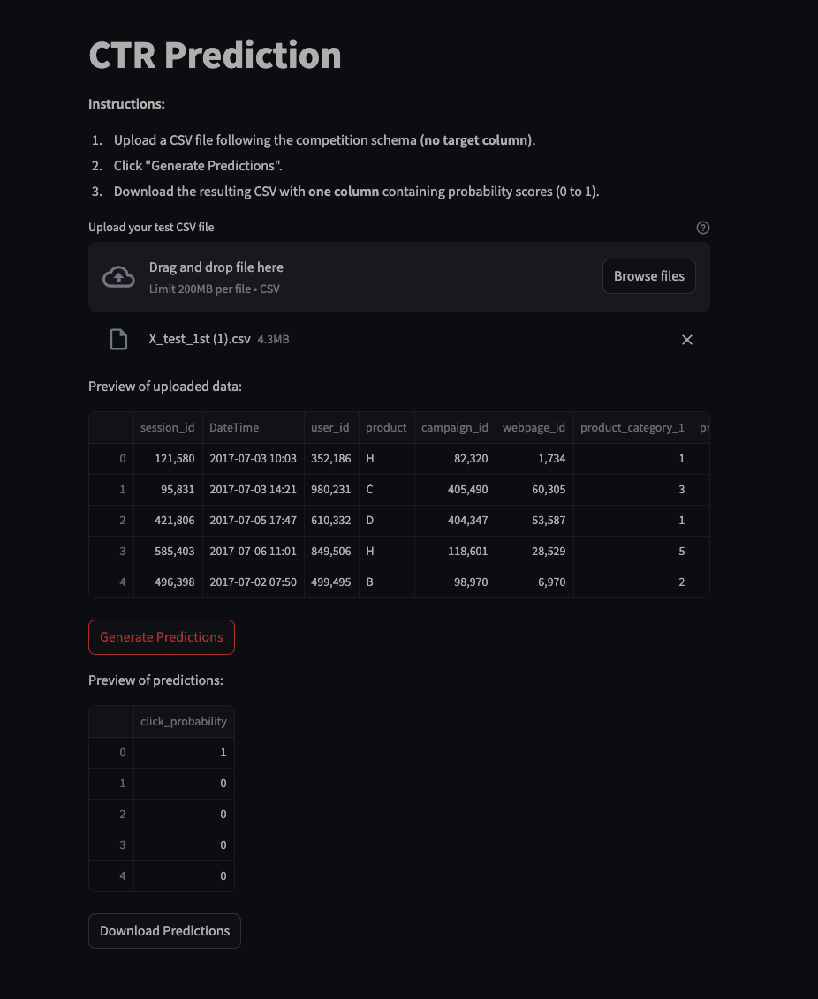

# ydata-ctr-prediction

Inspired by Serj’s lecture on project structure and best practices for data science.

## Project Structure

- `app/`: Streamlit app 
- `models/`: Trained models for the current experiment.
- `archived_experiments/`: Archived experiments and their outputs.
- `data/`: Input datasets and preprocessed data.
- `results/`: Outputs like predictions, charts, and analysis results.
- `notebooks/`: Jupyter notebooks for exploration and experimentation.
- `tests/`: Unit tests to ensure code quality.

Core scripts include:
- `preprocess.py`: Handles data preprocessing tasks.
- `train.py`: A script to train machine learning models.
- `predict.py`: Generates predictions using trained models.
- `result.py`: Analyzes results and generates metrics/charts.
- `tasks.py`: Automates workflows using `invoke`.


## Logging - Weights and biases project link
https://wandb.ai/amir324/ctr-prediction-kaggle?nw=nwuseramir324


## running Streamlit app 
```cd notebooks
streamlit run ../app/app.py
```
